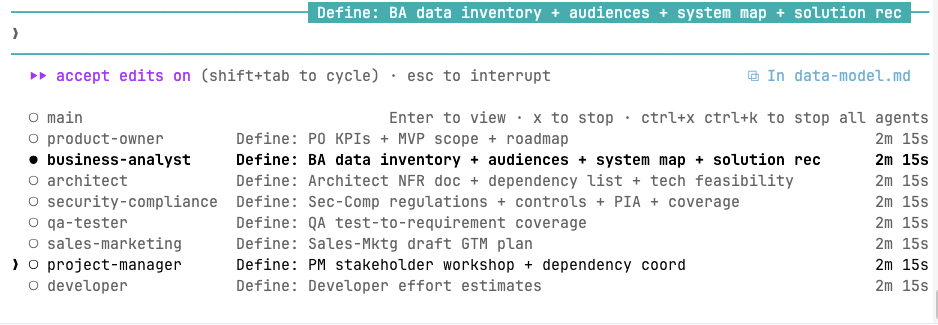

# `ai-pdlc` — a Claude Code plugin for the product development lifecycle

Acceleration across every phase for every role, so you get the outcomes you need sooner and move faster. `ai-pdlc` is a **Claude Code plugin** that installs a navigator skill, 14 role-aware subagents, and slash commands that orchestrate them — all grounded in a shared handbook so humans and AI work from the same definitions.

```bash
# From GitHub (aws-samples)
/plugin marketplace add aws-samples/sample-claude-code-agents-for-product-teams
/plugin install ai-pdlc@ai-pdlc

# From a local checkout of this repo
/plugin marketplace add /path/to/this/repo
/plugin install ai-pdlc@ai-pdlc
```

## How to use it

Three levels of use — pick the one that matches the size of your ask. The examples below each state the concrete outcome you can expect.

### Accelerate ideation through planning across every role

**`/product-ideation-to-planning`** — multi-phase, multi-role accelerator. Drop a PRFAQ, vision doc, pitch deck, or just a paragraph into `./artifacts/_seed/` (or paste it when you kick off), run the command, and walk away. The Product Sponsor, Product Owner, and Project Manager orchestrate the full 14-role team through **Discover → Define → Design → Plan**, dispatching specialists in parallel and parking human sign-offs in the sponsor decision register so your team moves faster without giving up control.

> *Outcome:* a draft artifact bundle at `./artifacts/` — vision, business case, requirements, NFRs, architecture, data model, API spec, threat model, test plan, SLOs, runbook, iteration plan, backlog, and more — with traceability back to your seed, a topologically sorted list of human sign-offs needed before Build starts, and a sponsor-review handoff ready to go. Your team still drives the outcomes; the plugin just gets you there sooner.

### Drive a project forward from wherever it is

**`/drive-product-phase`** — general phase-range driver. Point it at whatever you have (deployed app, git repo, existing artifacts bundle, napkin sketch) and name a target phase or a specific artifact. Product Owner + Project Manager co-orchestrate: PM reads the status ticker and fans work out, PO sharpens scope against the outcome hypothesis and KPIs, specialists execute in parallel, blockers get unblocked between passes.

> *Outcome:* the project moved from its current state to your named target phase or artifact, with every newly-produced artifact grounded in upstream context, human-signable gates queued in the sponsor decision register, and an offer to walk the register with the `product-sponsor` agent.

### Ask one role agent to do one thing

Every role is a subagent you can delegate to by name. They know their remit, their scope boundaries, which outcomes require a human sign-off, and when to dispatch peer roles for inputs they don't own.

`product-sponsor` · `product-owner` · `business-analyst` · `ui-ux-designer` · `architect` · `security-compliance` · `site-reliability-engineer` · `project-manager` · `developer` · `qa-tester` · `release-manager` · `technical-writer` · `sales-marketing` · `customer-support`

> *Outcome:* a single focused artifact (or a short set), written in the handbook's role-owner voice with the right Definition of Done, inputs, and consumers section — ready to drop into your artifact bundle.

Examples of the kind of asks each role handles well:

| Delegate to | Example asks |
|---|---|
| `product-owner` | "Groom this backlog — dedupe, flag staleness, re-order by outcome-hypothesis fit." · "Decompose this epic into delivery-ready work items with testable acceptance criteria." |
| `business-analyst` | "Write the requirements document and traceability matrix from this PRFAQ." · "Model the as-is vs. to-be process for onboarding and flag the gaps." |
| `architect` | "Produce an NFR document and dependency list for this feature." · "Run a build-vs-buy on this capability and draft the decision package." |
| `ui-ux-designer` | "Draft personas and a journey map from these user interviews." · "Audit this screen against WCAG AA and list the fixes." |
| `developer` | "Size this work-item and flag implementation risks." · "Review this PR for regressions against our Definition of Done." |
| `qa-tester` | "Build a test-to-requirement coverage map for these stories." · "Triage this bug list against release criteria." |
| `security-compliance` | "Draft the threat model for this new service." · "Produce the PIA for this data flow and flag anything above the sensitivity threshold." |
| `site-reliability-engineer` | "Propose SLIs/SLOs for this service and define the error budget." · "Run a resilience review on this design and list chaos tests we should run." |
| `release-manager` | "Write the deployment runbook and rollback procedure." · "Assemble the go/no-go decision package from these inputs." |
| `technical-writer` | "Draft the user guide and release notes for this feature." · "Audit our docs for stale content and broken links." |
| `sales-marketing` | "Produce a competitive landscape report and pricing benchmark." · "Write the launch announcement and sales battlecard." |
| `customer-support` | "Design the onboarding and health-score model for this segment." · "Cluster these tickets and produce the known-issues list." |
| `project-manager` | "Stand up a risk register and RAID log from this charter." · "Build the iteration plan and resource schedule for this squad." |
| `product-sponsor` | "Frame the kill/pivot/double-down decision for this bet." · "Stress-test this business case and surface counter-arguments." |

### Use the navigator skill for scoped walks

**`ai-pdlc-navigator`** — a skill that picks one of seven structured paths based on how you describe your situation. Good when you want a methodical walkthrough rather than end-to-end orchestration.

1. **Plan AI acceleration for my role** — *Outcome:* a list of 3-5 concrete AI accelerations grounded in the outcomes and artifacts you actually own.
2. **Plan AI acceleration for my whole project** — *Outcome:* a phase-by-phase acceleration map across your active roles with cross-phase handoff opportunities flagged.
3. **Discover the tools we use** — *Outcome:* a reusable tools inventory at `./artifacts/tools-inventory-YYYY-MM-DD.md` mapping every handbook capability category to the product your team actually uses for it.
4. **Create a new AI automation** — *Outcome:* a spec for one automation — purpose, inputs, outputs, scope boundaries, escalation triggers, success criteria — ready to build.
5. **Talk about an outcome or artifact** — *Outcome:* a canonical explanation of what it is, why it matters, its Definition of Done, and where it sits in the phase Exit checklist.
6. **Bootstrap a product** — *Outcome:* a starter artifact set generated from a PRFAQ, PRD, or wireframes into `./artifacts/` with traceability back to the source (lighter-weight cousin of `/product-ideation-to-planning`).
7. **Run an AI Maturity Assessment** — *Outcome:* interview-driven scoring across two lenses (automation per phase, readiness across 5 org dimensions) with top-3 leverage opportunities, saved to `./artifacts/YYYY-MM-DD-<scope>-maturity.md`.

Just tell Claude what you want — the navigator picks the path. *"Help me plan AI acceleration for the Developer role."* · *"Run an AI maturity assessment for our SRE team."* · *"Bootstrap a product from this PRFAQ."*

---

## The HITL line

Both slash commands and every role agent respect one rule: **AI agents never post `signed` entries to the sponsor decision register — only humans sign.** Your team stays in control of anything that commits the organization.

Expect the register to fill with `prepared` entries faster than you can review them. That's by design. `/product-ideation-to-planning` ends with a sponsor-agent handoff that proposes an ordered sign verdict — sign-now / defer / premature — so you work the queue in a sensible order.



*Seven role agents producing Define-phase artifacts in parallel: PO drafting KPIs and MVP scope, BA writing the data inventory and audiences, Architect producing NFRs and feasibility, Security-Compliance deriving controls and PIA, QA building the test-to-requirement coverage map, Sales-Marketing shaping the GTM plan, PM running stakeholder workshops and dependency coordination, Developer sizing effort — each a Claude Code subagent running concurrently.*

---

## Under the hood — the handbook

The plugin is powered by a tool-agnostic, human-readable handbook that describes **9 phases**, **14 role swim lanes**, ~130 activities, and ~260 artifacts and outcomes. Every role agent and every slash command is grounded in the same files.

> **Master index: [`AI-PDLC-linear-flow.md`](AI-PDLC-linear-flow.md)** — source of truth for the whole project. Every role, phase, activity, outcome, and artifact is listed and linked to its dedicated doc.


You don't need to read the handbook to use the plugin — the agents and commands do that for you. But it's all in plain Markdown if you want to browse, extend, or fork it.

### The 9 phases

| # | Phase | Goal |
|---|-------|------|
| 1 | **[Discover](phases/1-discover/README.md)** | Frame the opportunity, validate the problem, exit with a funded, strategically-aligned bet. |
| 2 | **[Define](phases/2-define/README.md)** | Turn the validated opportunity into approved requirements, scope, NFRs, KPIs, regulatory scope, and a commercial model. |
| 3 | **[Design](phases/3-design/README.md)** | Produce a build-ready design package — UX, architecture, data, APIs, threat model — with engineering signed off to build. |
| 4 | **[Plan](phases/4-plan/README.md)** | Stand up team, environments, pipeline, test strategy, SLOs, and a work-ready backlog. |
| 5 | **[Build](phases/5-build/README.md)** | Working, tested, instrumented increments that meet the Definition of Done. |
| 6 | **[Verify](phases/6-verify/README.md)** | Evidence-based readiness to launch — functional, non-functional, operational, documentation. |
| 7 | **[Launch](phases/7-launch/README.md)** | Product live, teams enabled, customers notified, baseline metrics captured, launch stabilized through hypercare. |
| 8 | **[Operate](phases/8-operate/README.md)** | Run a reliable, secure, compliant, profitable commercial service. |
| 9 | **[Iterate](phases/9-iterate/README.md)** | Measure vs. the business case; decide iterate / pivot / double-down (or sunset when warranted); feed validated learning back into Discover. |

### The 14 roles

| Role | Focus |
|------|-------|
| **[Product Sponsor](roles/product-sponsor.md)** | Portfolio strategy · funding · governance · iterate / pivot / double-down |
| **[Product Owner](roles/product-owner.md)** | Backlog · value · sequencing · stakeholder alignment |
| **[Business Analyst](roles/business-analyst.md)** | Requirements · traceability · benefits realization |
| **[UI/UX Designer](roles/ui-ux-designer.md)** | User research · usable, accessible design · design system |
| **[Architect](roles/architect.md)** | Solution design · NFRs · integration · technical fit |
| **[Security & Compliance](roles/security-compliance.md)** | Threat modeling · controls · audits · regulatory posture |
| **[Site Reliability Engineer](roles/site-reliability-engineer.md)** | SLOs · on-call · capacity · observability · release engineering |
| **[Project Manager](roles/project-manager.md)** | Delivery coordination · schedule · budget · risk · dependencies |
| **[Developer](roles/developer.md)** | Code · tests · review · operate-what-you-build |
| **[QA / Tester](roles/qa-tester.md)** | Risk-based coverage · automation · traceability |
| **[Release Manager](roles/release-manager.md)** | Release readiness · runbooks · rollback · cadence |
| **[Technical Writer](roles/technical-writer.md)** | User guides · API reference · changelogs · docs-as-code |
| **[Sales & Marketing](roles/sales-marketing.md)** | Positioning · pricing · launch · sales enablement · pipeline |
| **[Customer Support / Success](roles/customer-support.md)** | Onboarding · health scoring · renewals · support · VoC |

### Adoption resources

Under [`adoption/`](adoption/): the [maturity model](adoption/maturity-model.md), [anti-patterns](adoption/anti-patterns.md), [objection handling](adoption/objection-handling.md), [HITL framework](adoption/hitl-framework.md), and [bundle-format recipes](adoption/formats.md). Start here if your team is adopting AI teammates for the first time.

---

## Building or developing the plugin

The plugin source lives under [`plugin/`](plugin/). During development, `plugin/skills/ai-pdlc-navigator/content/` is symlinked to the repo-root handbook so edits show up immediately. At release time, `make package` materializes those symlinks into real copies under `dist/ai-pdlc-plugin/` so the plugin is self-contained.

```bash
make package         # build dist/ai-pdlc-plugin/ (symlink-free, ready to install)
make package-zip     # build and zip for distribution
make validate-links  # check handbook link integrity
```

The `make` targets also compile documentation images (`.drawio` → PNG/SVG). There is no application code to compile.

```bash
make              # PNG + SVG for every .drawio, plus the tracked docs/ copy
make svg          # SVG only
make png          # PNG only (into build/, gitignored)
make docs-png     # refresh docs/<name>.png (what this README embeds)
make clean        # remove build/ and dist/
make help         # list targets
```

Requires the `drawio` CLI for diagrams (Homebrew: `brew install --cask drawio`). `make package` requires `rsync` and `python3` (both on macOS by default).

See [`plugin/README.md`](plugin/README.md) and [`plugin/skills/ai-pdlc-navigator/SKILL.md`](plugin/skills/ai-pdlc-navigator/SKILL.md) for the full skill manifest and behavior rules.

**One handbook for humans and digital teammates.** Whether a human on your team reads this repo on GitHub or an AI teammate consults it via the plugin, they're working from the same phase definitions, role agent cards, artifact contracts, and Exit checklists. Everyone knows their swim lane.
